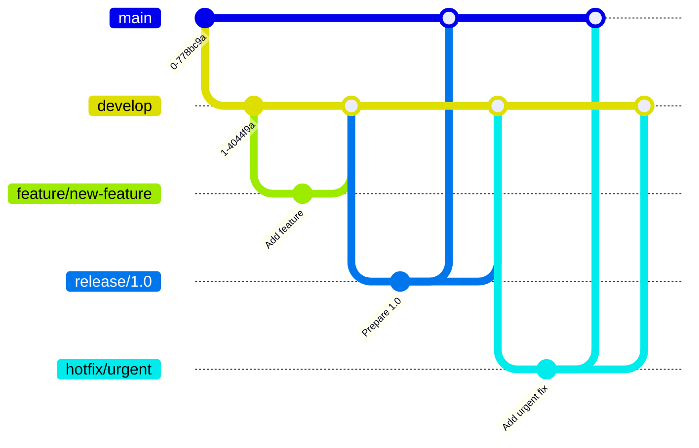

```mermaid
gitGraph
    commit
    branch develop
    checkout develop
    commit
    branch feature/new-feature
    checkout feature/new-feature
    commit id: "Add feature"
    checkout develop
    merge feature/new-feature
    branch release/1.0
    checkout release/1.0
    commit id: "Prepare 1.0"
    checkout main
    merge release/1.0
    checkout develop
    merge release/1.0
    branch hotfix/urgent
    checkout hotfix/urgent
    commit id: "Add urgent fix"
    checkout main
    merge hotfix/urgent
    checkout develop
    merge hotfix/urgent
```
